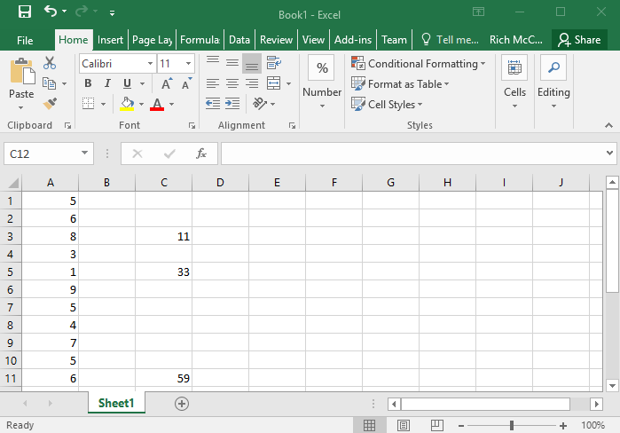
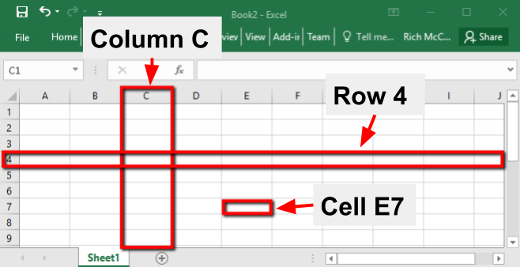
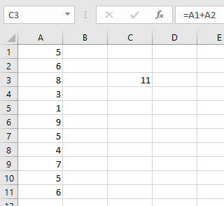
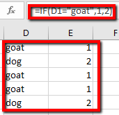

 
# Excel Basics and Data Cleaning
If you and your group have any questions or get stuck as you work through this in-class exercise, please ask the instructor for assistance.  Have fun!

1. Open Excel, and open a **Blank workbook.**
2. Rows, columns, and cells defined:   
   - Columns are vertical. Eg. **Column C.**
   - Rows are horizontal. Eg. **Row 3.**
   - Cells are the intersection between a column and a row. Eg. Cell **E7** (see image). 
 
 
   - Enter number **5** into cell A1 in your spreadsheet, and then press **Enter** on your keyboard.
   - Enter the following numbers in Column **A** below the number 5 you just entered: **6, 8, 3, 1, 9, 5, 4, 7, 5, 6.**  We will use this list of numbers for the rest of this       exercise.

3. **Basics operation on cells**:
  - Click on Cell **C3**, press the = sign, then use your mouse and click on A1, press the + sign, then click on Cell A2. Cell C3 should have the following in it: =A1+A2. Now press **Enter** on your keyboard, and Excel will add cells **A1** and **A2** together and display the number 11 in Cell C3. 
 
  - Click on or Select Cell C5, and then type in **=A3-A4**  Now press **Enter** on your keyboard, and Excel will display **5** in Cell **C5** (8-3=5). 
 
  - Click on another cell and do the same thing to multiply two or more cells together using the * symbol to multiply. 
 
  - Click on another cell and do the same thing to divide two or more cells using the / symbol to divide. 

4. **Copying & pasting into ranges** with the default Relative Cell referencing:
  - In cell **B1** type **5** and then press **Enter**. Click on **B1**, then **select** the **green dot** on the **bottom right of the cell** and **drag it** down to cell **B11**. You should now have a column of 5’s. 
 
  - In cell **C1** enter: **=A1*B1** and press **Enter** (please delete the data currently in column C). Click on **C1**, then **select** the **green dot** on the **bottom right of the cell** and **drag it** down to cell **C11**. You’ve just multiplied all the rows in column A and B and put the result in column C! 
 

5. Relative cell referencing is the default. Here is how you make an **Absolute Cell Reference**:
 
  - **Delete** the contents of columns **B** and **C** **except for the first row** (cells **B1** and **C1**).
  - **Double-click** on cell **C1**, and then **edit the formula** to look like this: **=A1*B$1**. Press **Enter**.
  - Click on **C1**, **select** the **green dot** on the **bottom right of the cell** & **drag it** down to cell **C11**.
  - If you’d like more details on absolute cell referencing, [view this page](http://bit.ly/2EGE4EY){:target="_blank"} 

6. OPTIONAL: The **Text to Columns** tool can come in handy when you want to split a table of text (like on a web page) into multiple cells. If you’d like more information on converting text to columns, [view this video](http://bit.ly/2HYNA7y){:target="_blank"} 

7. OPTIONAL: How to filter data using the filter button. If you’d like more details on filtering data in a range, [view this video](http://bit.ly/2I3qI6N){:target="_blank"} 

8. OPTIONAL: Data Cleaning using Find, Replace & Pivot Tables: 
  - If you’d like more details on finding or replacing data, [view this video](http://bit.ly/2I09Qhy){:target="_blank"} 
  - Sort a column of data and then look down it for mis-spellings, [View a data organization guide](http://bit.ly/2Yk2FaT){:target="_blank"} 
  - For very large data sets, you can create a Pivot table - using the group by function - can help you quickly identify misspelled words. See the Pivot Table & Charts handout for details.
  - For larger and more complex datasets, [OpenRefine](http://openrefine.org/){:target="_blank"} is a more powerful tool than Excel for cleaning data: OpenRefine is a free, Open Source tool.

9. How to change categorical data (e.g., male, female) into “true”, “false”:
 
  - In cell **E4** enter: **goat**, in **E5** enter: **dog**, in **E6** enter: **goat**, in **E7** enter, **goat**, in **E8** enter **dog**.
  - In cell **F4** enter: **=IF(E4="goat",1,2)**   Press the **Enter** key. The number 1 should appear in cell **F4**. Select cell **F4**, and then grab and drag the **green dot** in the bottom right of the cell down to cell **F8**.
  - Another way to do this would be to use the VLOOKUP function that will be covered in a later activity. 
 

10. Data Validation:
  - One of the easiest ways to validate data is to use an input form with radio boxes or drop-down menus as you see in all online survey tools. Google Sheets has an excellent Forms tool that can be used to collect data you enter yourself or survey data from research participants. Google Forms, puts the data into Google Sheets, which can then be either analyzed in Google Sheets or exported to MS Excel. [Here is more information about Google Forms](http://bit.ly/2FBqK5y){:target="_blank"}
  - If you’d like more information on data collections forms and validation in Excel, view please follow along with [this video](http://bit.ly/2I2jEYb){:target="_blank"}

[NEXT STEP: Intro to Functions](intro-functions.html){: .btn .btn-blue }
