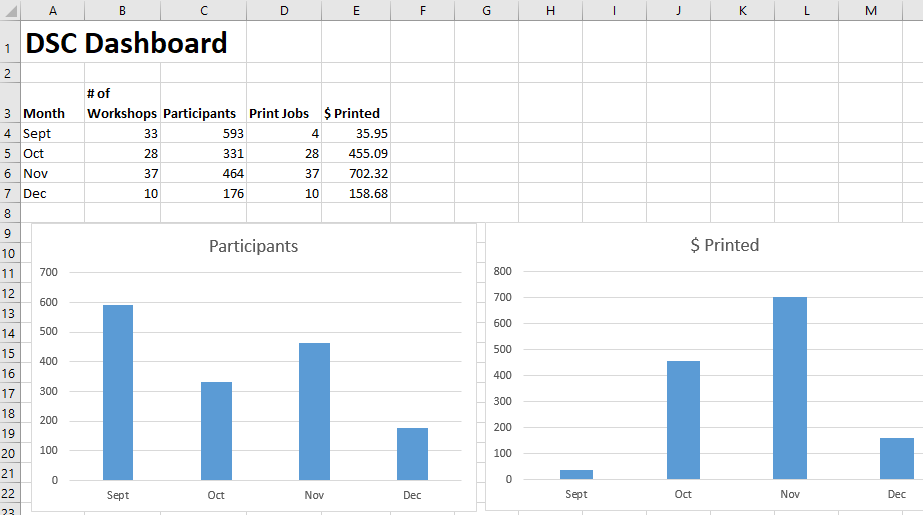
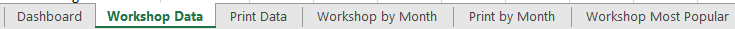
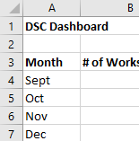
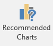
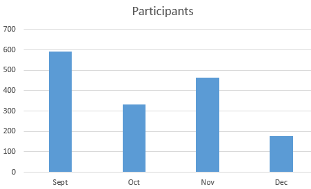

# Creating a Digital Dashboard
In this activity, you will create a Digital Dashboard, integrating data from a number of sheets and pivot tables. If you have any questions or get stuck as you work through this in-class exercise, please ask the instructor for assistance.  Have fun!
  
 
1. **Download & open** [this spreadsheet with data for this exercise](https://bit.ly/dsc-dashboard). **Click** on the yellow **Enable Editing** button at the top of the screen.

2. Look at the data in each sheet, by **clicking** on the **tabs** at the bottom of the spreadsheet (see below). Note that the “Workshop Most Popular” pivot table sheets summarize the “Workshop Data” sheet.
 
 
3. Click on the **Dashboard** tab at the bottom left of the spreadsheet and give this sheet the title of **DSC Dashboard** in cell **A1**.  

4. Link the Most Important statistics or Key Data to your Dashboard from other sheets:
  
  - In **A3** type **Month**. In **B3** type # of Workshops. In **C3** type **Participants**. In **D3** Print Jobs. In **E3** type **$ Printed**. 
  - In the rows **under month** column **type: Sept, Oct, Nov, Dec** (see right).
  - Add the number of workshops from each month to the Dashboard sheet: In cell **B4** type: **=** then **click** on the **Workshop by Month** tab, and **select** cell **B5**, then press **Enter**. Do the same for October, November, & December. 
  
  - Add the number of participants from each month on the Dashboard sheet: In cell **C4** type: **=** then **click** on the **Workshop by Month** tab, and **select** cell **C5**, then **Enter**. Do the same for October, November, & December. 
   
  - Add the number of print jobs from each month on the Dashboard:  In cell **D4** tupe: **=** then **click** on the **Print by Month** tab, and **select** cell **B4**, then press **Enter**. Do the same for October, November, & December. 
    
  - Add the dollar value of print jobs from each month on the Dashboard: In cell **E4** type: **=** then click on the **Print by Month** tab, and select cell **C4**, then press **Enter**. Do the same for October, November, & December.   
  

5. Create Visualizations for your most important statistics or key indicators:
  
  - Create a bar graph of workshop participants by month by **selecting A3:A7** and then **hold down your ctrl key** (or **command key** on a Mac) and **select C3:C7**.
  - Next, **select** the **Insert tab** at the top of the screen, and then **click** on **Recommended Charts**. The default bar chart should work fine, so **click OK**. Click on the Chart Title and rename it to **Participants**. 
  - Create a bar graph of $ printed by month by **selecting A3:A7** and then **hold down your ctrl key** (or **command key** on a mac) and **select E3:E7**.
  - Next, **select** the **Insert tab** at the top of the screen, and then click on **Recommended Charts**. The default bar chart should work fine, so **click OK**. **Click** on the **Chart Title** and rename it to **$ Printed** 
 
 
6. Now when you enter additional data into either your **Workshop Data** or **Print Data** sheets, your Dashboard sheet summary numbers and charts will update automatically! 
  
   
  
_Great job!_ 
[NEXT STEP: Earn a Workshop Badge](informal-credentials){: .btn .btn-blue }
