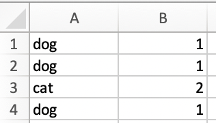
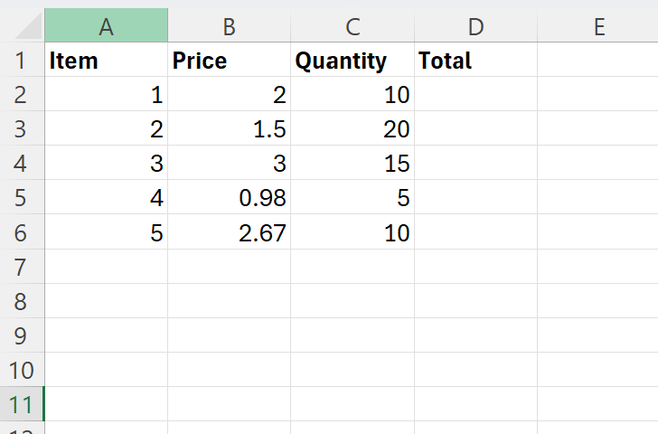
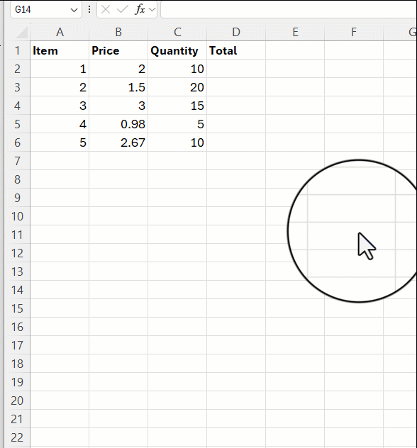
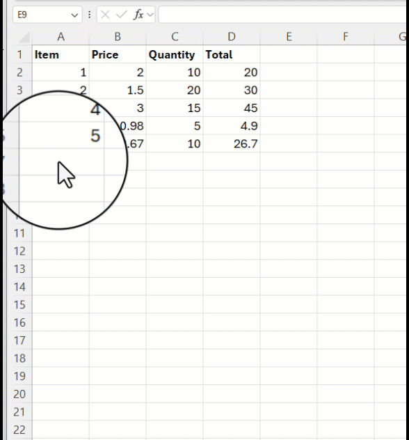
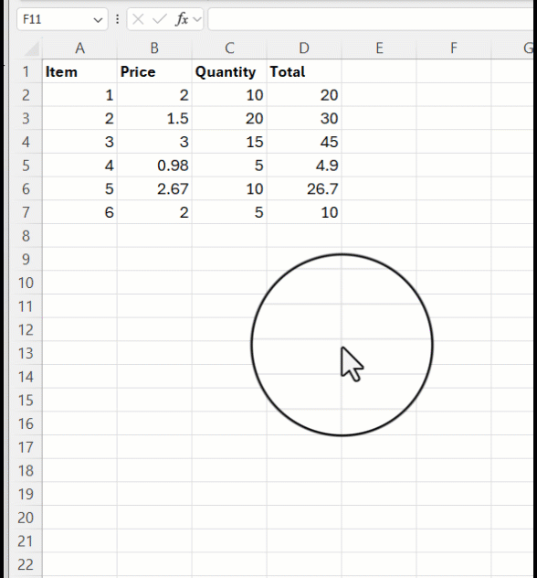
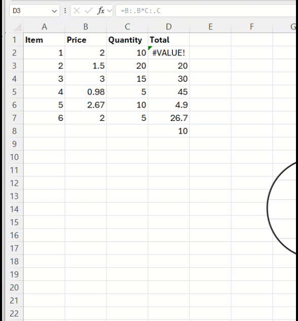
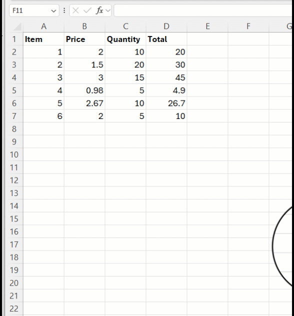
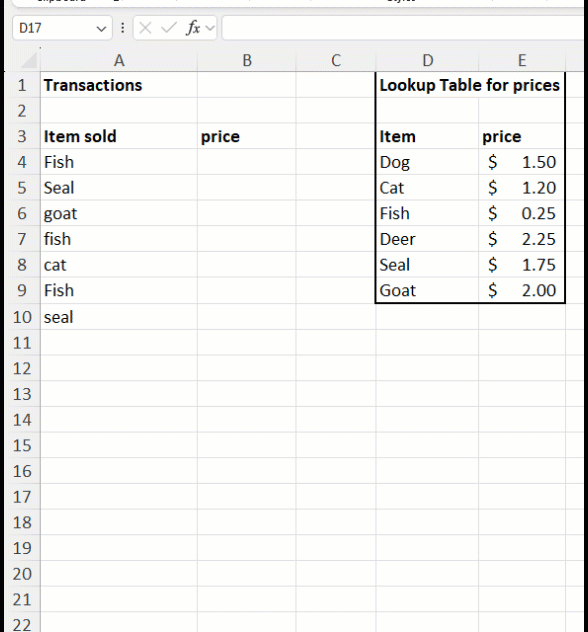

 

# Introduction to Functions

Functions are powerful tools that can quickly let you make complex calculations. If you and your group have any questions or get stuck as you work through this in-class exercise, please ask the instructor for assistance.  

First, open Excel, and open a **Blank workbook**.
  - If you are starting fresh from this activity, enter number **5** into Cell **A1** in your spreadsheet, and then press **Enter** on your keyboard. Enter the following numbers in Column A below the number 5 you just entered: **6, 8, 3, 1, 9, 5, 4, 7, 5, 6**. We will use this list of numbers for the rest of this exercise.
  - If you are continuing from previous activities, these are the same numbers as before, so you can just copy and paste them if you prefer. If needed, [here](https://support.microsoft.com/en-us/office/move-or-copy-cells-rows-and-columns-3ebbcafd-8566-42d8-8023-a2ec62746cfc){:target="_blank"}'s a quick video with instructions on how to copy and paste (start at the 48s mark)

All functions in Excel work in a similar way:
   - To use a function, you need to type "=" in any cell, and then Excel will know that you will use a function in that cell. Alternatively, a "=" sign also means that you will ask Excel to do a calculation (e.g., "=2+3" will show 5 in the cell)
   - After the "=" sign, you should type the name of the function you want to use, followed by parentheses. For example, if using the SUM function, you should type "=SUM()"
   - Inside the parentheses, you should add the arguments for the function. Each function has different arguments; some have only one, some have multiple. When a function has more than one argument, they are separated by a comma.
   - You will note that, as you start typing the function name, Excel will show you all the functions that start with those letters, and you can double-click in any of the options for Excel to fill in the function name for you.
   - When the function name and the first parenthesis are written, and you put the cursor on the function name, a small square with the full function name and its arguments appears below the cursor. You can then click on the function name, and a help window for the function will appear. The help window shows what the function does, what its arguments are, and a few examples.

  <button onclick="toggle('gif1')">Show/Hide Animation</button>
  

  
  

## Some basic functions
Below, we go through some functions that are frequently used. If this is new information to you, you might want to try out the examples we provide in your Excel worksheet.

1. **SUM function:** The sum function quickly and easily adds up a range of numbers for you.
  - In cell **A13** type: **=sum(A1:A11)** and press **Enter** on your keyboard. Cell **A13** should now have the number **59** in it. 
    <button onclick="toggle('gif1')">Show/Hide Animation</button>
    

    
    

  - Rows can also be summed. Enter some numbers in cells **A16** to **D16**, and then in cell **A17** type: **=sum(A16:D16)**  After pressing **Enter**, the sum of those four numbers should appear.
  - If you would like additional information on the SUM function, here is a [Microsoft video tutorial](http://bit.ly/2HZ9Jmi){:target="_blank"}

2. **INT function**: The INT function rounds a number down to the nearest integer. For example, =INT(5.6789) would return 5
  - If you would like additional information on the INT function here is a [Microsoft tutorial](http://bit.ly/2I2qFIv){:target="_blank"}

3. **COUNTA function**: Counts the number of non-empty cells in a range whether the cells have number or text in them. 
  - In an empty cell enter: **=counta(A1:A20)**
  - If you would like additional information on the COUNTA function here is a [Microsoft tutorial](https://bit.ly/2Ie37Rh){:target="_blank"}

4. **COUNTIF function**: For example, **=COUNTIF(A2:A5,"London")** counts the number of cells with **London** in the range A2 to A5. Note: The COUNTIF function is not case sensitive, but it will not count a field if it contains additional text like, "London, England" for example. You can also use the COUNTIF function to count specific numeric values; it works for both numbers and text.
  - If you would like additional information on the COUNTIF function here is a [Microsoft tutorial](https://bit.ly/2I4IFCh){:target="_blank"}

5. **CONCATENATE function**: Joins two or more text strings into one string. For Example, if cell **A1** contains **Victoria** and cell **B1** contains **BC**, join the two text strings together in cell **C1** with a space and a comma between them using the following function: **=CONCATENATE(A1, ", ",B1)** will give you: **Victoria, BC**.
  - If you would like additional information on the CONCATENATE function here is a [Microsoft tutorial](http://bit.ly/2I2qTzl){:target="_blank"}

6. **VALUE function**: Converts a text string that represents a number to a number. For example, it would convert the text string **$1,000** to the number **1000**. Excel cannot add up text even if it looks like a number. 
  - Enter **$1,000** into cell **C1**. In cell **C2** enter =**value(C1)**   This will return the number 1000 that you can now perform mathematical operations on.
  - If you would like additional information on the VALUE function here is a [Microsoft tutorial](http://bit.ly/2I0O1OR){:target="_blank"}  
 
7. **LEN function**: returns the number of characters in a text string. Eg. Enter **=LEN("test text")** into cell **C3** . This will return **9**, as there are 9 characters in the text string “test text” (a space is a character). 
  - If you would like additional information on the LEN function here is a [Microsoft tutorial](http://bit.ly/2I0lYiA){:target="_blank"}  

8. **IF function**: Use the IF function to check whether a condition is met and return a value. It can also return a different value if the condition is not met. Alternatively, you can use the IFS function to check whether one or more conditions are met and return a value that corresponds to the first TRUE condition. If you'd like, you can explore the differences between the IF and IFS functions, please [**click here**](https://g.co/gemini/share/bde35b0efd90){:target="_blank"}. 
 - Both the IF and IFS functions (or any conditional function) use Excel logical operators:
     - **=** means "equal to"
     - **<>** means "not equal to"
     - **>** means "greater than"
     - **<** means "less than"
     - **>=** means "greater than or equal to"
     - **<=** means "less than or equal to"

  
  - Create a new sheet (press the **+** button on the bottom of Excel) and in cells **A1** To **A4** type: **dog, dog, cat, dog** as you can see to the right.
  - In cell **B1** Type: **=IF(A1="dog",1,2)** and press the **Enter** key. This formula looks at **A1**, and if **dog** is found then it will return a **1**, and if it is not found then it will return a **2**.
  - Select cell **B1**, and then grab the **green dot** at the bottom right of the cell, and drag it down to cell **B4**. You should now see a **1** beside each **dog** and a **2** beside the **cat**. 
    <button onclick="toggle('gif2')">Show/Hide Animation</button>
    

    
    

    
   - Remember, you could also achieve the same by using **dynamic formulas**. To do that, delete the values in column B, and then type  **=IF(A1:A4="dog", 1, 2)** in cell B1 and hit **enter**.
    <button onclick="toggle('gif2')">Show/Hide Animation</button>
    

    
    

9. **DROP function**: Use DROP when you need to remove a specified number of rows or columns from a selection of cells (i.e., an array). For example, in cell D5, type **=DROP(A1:A4,2)** and hit enter. The values from A1:A4, skipping the first 2 rows, will appear.

10. **XLOOKUP function**: Use XLOOKUP when you need to find things in a table or a range by row. For example, look up the price of a sale item by item name.
  - **Download** [this spreadsheet](docs/dsc-vlookup.xlsx){:target="_blank"} and open it in Microsoft Excel. If needed, **click** on the yellow **Enable Editing** button at the top of the screen..
  - The basic structure of the XLOOKUP function:

    **XLOOKUP(what you want to look up, where you want to look for it, what you want to be returned, what to return if
    not match if found - optional, specify appropriate or exact match - optional)**
    
  - For example, in the downloaded spreadsheet, you have a list of items sold, where the same item can be sold more than once. You also have a table showing the price of each item. Imagine you want to add the price of each item sold to be able to calculate the total amount sold. That is when the XLOOKUP function comes in. You can tell Excel to look up the name of the item (what you want to look up) in the Item column of the price table (where you want to look for it) and return the value that appears in the Price column for the same row (what you want to be returned).

  - To do this, in cell **B4**, type: **=XLOOKUP(A4,$D$4:$D$9,$E$4:$E$9)**, as shown in the figure below. Instead of
    typing, you can also select the cells specified, just remember to add the "$" sign to create absolute cell references.
  

  - **Copy and paste** the contents of **B4** into **B5 to B10**. You can do this by clicking on B4 and dragging the box all the way to B10.
    
    NOTE: This is an example where making an absolute cell reference is important. If you had not locked the references for the Item and Price columns in cell B4 using **$**, as you copied the content down, the relative reference of cells in Excel would automatically apply, and Excel would shift down the cells where you are looking up values and finding values to return. This would cause problems. What you want when copying the content of B4 down is to shift down **the value** you are looking for, but not **where** you are looking for it or finding the value to return. After copying and pasting the content, click on cell B10, and check what its content is. It should be **=XLOOKUP(A10,$D$4:$D$9,$E$4:$E$9)**.
    
  - **Type** in a few **item names** (like “Dog” or “Seal” for example) from the lookup table in field **A11 and below**.
  - **Copy** cell **B4** and then **select** cells **B11 and below** and **paste** so that each of the items sold you have entered has a price beside them.
  - If you would like additional information on the XLOOKUP function here is a [Microsoft tutorial](https://support.microsoft.com/en-us/office/xlookup-function-b7fd680e-6d10-43e6-84f9-88eae8bf5929){:target="_blank"}

## Using functions efficiently

Excel has many features that can help you use functions more efficiently.
One of them is the **dynamic formulas** shown in the [Fundamentals Skills ](basic-data-cleaning.md) section, and exemplified again above for the IF function. 

Another useful feature is the **dot operator**. When pairing the dot operator with dynamic formulas, you can write formulas very efficiently. **The dot operator** lets you trim ranges of values so that only cells with actual content remain in the calculations. For example, imagine you have the following list of items to purchase, with quantity and individual prices of each item (you might want to open a new sheet and type in these values to follow along):

You could use relative cell referencing or dynamic formulas to calculate the total value of each item:

However, if you added more items later on, you would need to retype the formula:

So you might want to make the original formula already encompass the empty rows below the current data. However, if you do that just as it is, you are going to have several 0`s in the Total column:

This is where the **dot operator** comes in handy. The dot operator can be used to trim the empty values at the beginning or end of a set of cells.  In a range of cells **A:A**, you can use the dot after the first letter (**A.:A**) to remove the leading empty cells (i.e. empty cells at the beginning), and the dot after the second letter (**A:.A**) to remove the trailing empty cells (i.e. empty cells at the end).

In this case, instead of selecting a large range for columns B and C, you can just select the entirety of columns B and C for the multiplication, and use the dot operator to remove the trailing set of empty cells.

The final step here is to make sure the multiplication is skipping the first row, which contains the names of the columns rather than the values. For this, you can use the DROP function learned above:

Now, if you add additional items at the bottom, Excel will automatically calculate their total value: 

### Challenge!
Now it is your turn to try to merge the use of dynamic formulas and the dot operator to make use of functions more efficiently! In the example of the XLOOKUP function above, modify the formula entered in cell B4 so that new items entered in column A will automatically have their price added to column B.

*Hint*: Start by deleting the previous formulas. You will then need to use dynamic formulas and the dot operator inside the XLOOKUP function, as well as the DROP function. 
     
<button onclick="toggle('gif3')">Show/Hide Answer</button>

[NEXT STEP: Statistical Functions](statistical-functions.html){: .btn .btn-blue }
