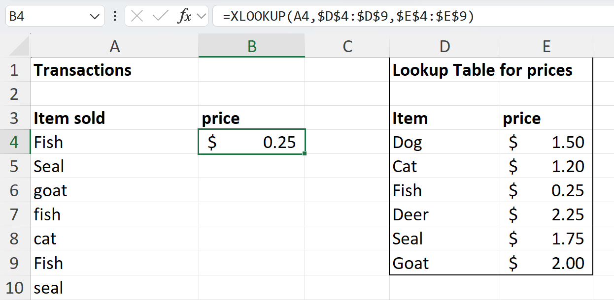
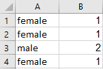

 
# Introduction to Functions
Functions are powerful tools that can quickly let you make complex calculations. If you and your group have any questions or get stuck as you work through this in-class exercise, please ask the instructor for assistance.  Here are some functions that are frequently used:

1. Open Excel, and open a **Blank workbook**. 
  - Enter number **5** into Cell **A1** in your spreadsheet, and then press **Enter** on your keyboard.
  - Enter the following numbers in Column A below the number 5 you just entered: **6, 8, 3, 1, 9, 5, 4, 7, 5, 6**.  We will use this list of numbers for the rest of this exercise.

2. **SUM function:** The sum function quickly and easily adds up a range of numbers for you.
  - In cell **A13** type: **=sum(A1:A11)** and press **Enter** on your keyboard. Cell **A13** should now have the number **59** in it. 

  - Rows can also be summed. Enter some numbers in cells **A16** to **D16**, and then in cell **A17** type: **=sum(A16:D16)**  After pressing **Enter**, the sum of those four numbers should appear.
  - If you would like additional information on the SUM function, here is a [Microsoft video tutorial](http://bit.ly/2HZ9Jmi){:target="_blank"}

3. INT function: The INT function rounds a number down to the nearest integer. For example, =INT(5.6789) would return 5
  - If you would like additional information on the INT function here is a [Microsoft tutorial](http://bit.ly/2I2qFIv){:target="_blank"}

4. **COUNTA function**: Counts the number of non-empty cells in a range. 
  - In an empty cell enter: **=counta(A1:A20)**
  - If you would like additional information on the COUNTA function here is a [Microsoft tutorial](https://bit.ly/2Ie37Rh){:target="_blank"}

5. **COUNTIF function**: For example, **=COUNTIF(A2:A5,"London")** counts the number of cells with **London** in the range A2 to A5.
  - If you would like additional information on the COUNTIF function here is a [Microsoft tutorial](https://bit.ly/2I4IFCh){:target="_blank"}

6. **VLOOKUP function**: Use VLOOKUP when you need to find things in a table or a range by row. For example, look up the price of a sale item by item name.
  - **Open** [this spreadsheet](docs/dsc-vlookup.xlsx){:target="_blank"} and **Click** on the yellow **Enable Editing** button at the top of the screen.
  - In the **B4** field **type**: **=VLOOKUP(A4,$D$4:$E$9,2,FALSE)**

  - **Copy and paste** the contents of **B4** into **B5 to B10**.
  - **Type** in a few **item names** (like “Dog” or “Seal” for example) from the lookup table in field **A11 and below**.
  - **Copy** cell **B4** and then **select** cells **B11 and below** and **paste** so that each of the items sold you have entered has a price beside them.
  - Modify the VLOOKUP formula in the B column to use the IF function so that it ignores all blank fields in the A column, and only uses the VLOOKUP function if there is something in the A column. **Type** the following formula into **B4**: **=IF(A4<>"",VLOOKUP(A4,$D$4:$E$9,2,FALSE),"")**
  - **Copy** the **B4** cell, then select cells **B5 to B25** and **paste**.
  - If you would like additional information on the VLOOKUP function here is a [Microsoft tutorial](http://bit.ly/2I4IoiJ){:target="_blank"}

7. **CONCATENATE function**: Joins two or more text strings into one string. For Example, if cell **A1** contains **Victoria** and cell **B1** contains **BC**, join the two text strings together in cell **C1** with a space and a comma between them using the following function: **=CONCATENATE(A1, ", ",B1)** will give you: **Victoria, BC**.
  - If you would like additional information on the CONCATENATE function here is a [Microsoft tutorial](http://bit.ly/2I2qTzl){:target="_blank"}

8. **VALUE function**: Converts a text string that represents a number to a number. For example, it would convert the text string **$1,000** to the number **1000**. Excel cannot add up text even if it looks like a number. 
  - Enter **‘$1,000** into cell **C1**. In cell **C2** enter =**value(C1)**   This will return the number 1000 that you can now perform mathematical operations on.
  - If you would like additional information on the VALUE function here is a [Microsoft tutorial](http://bit.ly/2I0O1OR){:target="_blank"}  
 
9. **LEN function**: returns the number of characters in a text string. Eg. Enter **=LEN("test text")** into cell **C3** . This will return **9**, as there are 9 characters in the text string “test text” (a space is a character). 
  - If you would like additional information on the LEN function here is a [Microsoft tutorial](http://bit.ly/2I0lYiA){:target="_blank"}  

10. **IFS function**: Use the IFS function to check whether one or more conditions are met and returns a value that corresponds to the first TRUE condition.

  - Create a new sheet (press the **+** button on the bottom of Excel) and in cells **A1** To **A4** type: **female, female, male, female** as you can see to the right.
  - In cell **B1** Type: **=IF(A1="female",1,2)** and press the **Enter** key. This formula looks at **A1**, and if **female** is found then it will return a **1**, and if it is not found then it will return a **2**.
  - Select cell **B1**, and then grab the **green dot** at the bottom right of the cell, and drag it down to cell **B4**. You should now see a **1** beside each **female** and a **2** beside the **male**. 

[NEXT STEP: Statistical Functions](statistical-functions.html){: .btn .btn-blue }
