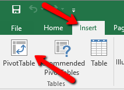
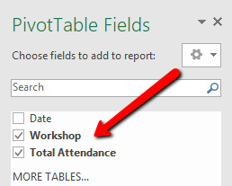
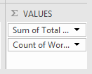
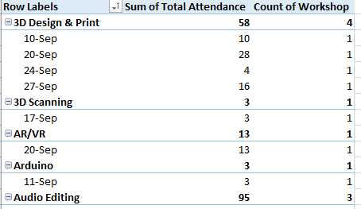
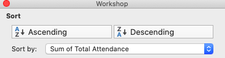
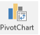
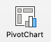

 
# Pivot Tables and Charts
Pivot Tables are a powerful tool that can help you quickly summarize your data. If you have any questions or get stuck as you work through this in-class exercise, please ask the instructor for assistance. 

1. Download [this spreadsheet with data for this exercise](docs/dsc-pivot-table.xlsx){:target="_blank"} Note: You may have a yellow bar at the top with a button that says **Enable Editing**. Click on that to enable editing.

2. Create a default pivot table in the spreadsheet you just downloaded:
 
  - Select all the data in the spreadsheet from A1 to C34.
  - Select the **Insert** tab, and then press the **PivotTable** button on the top left of the ribbon.
  - When the PivotTable dialogue box appears, press **OK**.
 

3. You now have a blank canvas of a pivot table setup. Let’s add data:
 
  - Select the **Workshop** and **Total Attendance** checkboxes on the right hand PivotTable Fields toolbar. You now have a list of workshops with a sum of total attendance for each workshop sorted by the workshop name.
  - Let’s add a column to count the number of each type of workshop held: In the PivotTable Field Name area, grab **Workshop**, and drag it to the **∑ Values** area in the bottom right of the Excel window. You should now have a pivot table with another column named, “Count of Workshop”.
 
  - Lastly, select the **Date** checkbox in the PivotTable. 
  - Move **Date** into Rows field. You should now have a pivot table that looks like this:

4. Let’s create a chart:
  - Start by un-selecting **Date** in the PivotTable field name area.
  - In the **∑ Values** area, **right mouse click** on Count of Workshop and select **Remove Field**.
  - Sort the Sum of Total Attendance column by clicking on the little arrow facing down (found within the “row labels” cell). Then select “Descending” and sort by the “sum of Total Attendance”. Feel free to try this by selecting “Ascending” instead as well.
 
  
  - Select the **Insert** tab on the top ribbon, and then select the **PivotChart** button in the ribbon. 
 
  - Click **OK**, and now you have a basic chart. Please feel free to experiment with both the data and the chart. 

_Great job!_

[NEXT STEP: Automation with Macros](automation-macros.html){: .btn .btn-blue }
