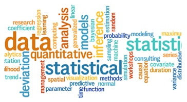
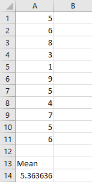
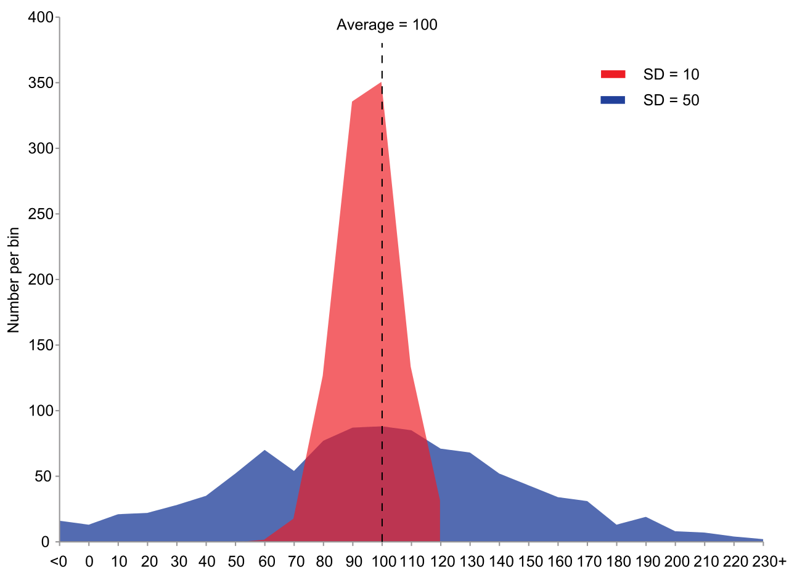

 
# Statistical Functions

Statistical Functions are powerful tools that can quickly let you make complex calculations. If you and your group have any questions or get stuck as you work through this in-class exercise, please ask the instructor for assistance. Here are some statistical functions that are frequently used:
  
1. Open Excel, and open a **Blank workbook**.
  - Enter number **5** into cell **A1** in your spreadsheet, and then press **Enter** on your keyboard.
  - Enter the following numbers in Column A below the number 5 you just entered: **6, 8, 3, 1, 9, 5, 4, 7, 5, 6**.  We will use this list of numbers for the rest of this exercise.

2. **AVERAGE function (Mean)**: Returns the arithmetic mean of a range of numbers.
  
  - Enter in **A13**: **Mean**
  - Enter in **A14** the formula **=AVERAGE(A1:A11)** and then press the **Enter** key. 
  - **A14** should contain **5.363636** which is the arithmetic mean of those eleven numbers.

3. **MEDIAN function**: Returns the median of the given numbers. The median is the number in the middle of a set of numbers.

  - Enter in **B13**: **Median**
  - Enter in **B14** the formula **=MEDIAN(A1:A11)** and then press the **Enter** key. 
  - **B14** should contain **5** which is the median or in the middle of those eleven numbers.

4. **MODE function**: Mode returns the most frequently occurring value in the range of data.
  - Enter in **C13**: **Mode**
  - Enter in **C14** the formula **=MODE(A1:A11)** and then press the **Enter** key. 
  - **C14** should contain **5** which is the most common number out of those eleven numbers. 

5. **MAX, MIN functions & Range**: In order to calculate the range of a group (or range) of data in Excel we must first use the MIN and MAX functions to find the spread of values.
  - Enter in **D13**: **Range**
  - Enter in **D14** the formula **=MAX(A1:A11)-MIN(A1:A11)** and then press the **Enter** key. 
  - **D14** should contain **8** which is the range between those eleven numbers.

6. **STDEV.S function (Standard Deviation)**: Estimates standard deviation based on a sample (ignores logical values and text in the sample). The standard deviation is a measure of how widely values are dispersed from the average value (the mean).
  - Enter in **E13**: **Std Dev**
  - Enter in **E14** the formula **=STDEV.S(A1:A11)** and then press the **Enter** key. 
  - **E14** should contain **2.248232** which is the standard deviation of those eleven numbers.

7. **VAR.S function (Sample Variance)**: Estimates variance based on a sample range.
  - Enter in **F13**: **Sample Var**
  - Enter in **F14** the formula =**VAR.S(A1:A11)** and then press the **Enter** key. 
  - **F14** should contain **5.054545** which is the sample variance of those eleven numbers.

8. **KURT function (Kurtosis)**: Returns the kurtosis of a data set. Kurtosis characterizes the relative peakedness or flatness of a distribution compared with the normal distribution. Positive kurtosis indicates a relatively peaked distribution. Negative kurtosis indicates a relatively flat distribution.
  - Enter in **G13**: **Kurtosis**
  - Enter in **G14** the formula **=KURT(A1:A11)** and then press the **Enter** key. 
  - **G14** should contain **0.339462** which is the kurtosis of those eleven numbers.

9. SKEW function (Skewness): Returns the skewness of a distribution. Skewness characterizes the degree of asymmetry of a distribution around its mean. Positive skewness indicates a distribution with an asymmetric tail extending toward more positive values. Negative skewness indicates a distribution with an asymmetric tail extending toward more negative values.
  - Enter in **H13**: **Skewness**
  - Enter in **H14** the formula **=SKEW(A1:A11)** and then press the **Enter** key. 
  - **H14** should contain **-0.297596** which is the Skewness of those eleven numbers.

10. STANDARDIZE function: “In statistics, standardization is the process of putting different variables on the same scale. This process allows you to compare scores between different types of variables.” ([Standardization resource by Jim Frost](https://bit.ly/2KaqjlV){:target="_blank"}) The STANDARDIZE function returns a normalized value from a distribution characterized by mean and standard_dev. Eg. =STANDARDIZE(5,5.363,2.248)  Normalized value of 5, using 5.363 as the arithmetic mean and 2.248 as the standard deviation. The result is: -0.1617
  - Enter in **J13**: **Standardize**
  - Enter in **J14** the formula **=STANDARDIZE(C14, A14, E14)** and then press the **Enter** key. 
  - **J14** should contain **-0.161743283** which is Standardized for the mode.

**Note:** Microsoft offers a free **Analysis ToolPak** to help you perform more complex statistical analysis. Additional tools in the ToolPak include: Anova, Covariance, F-Test, Regression, t-Test, z-Test, among others. [Download this free Excel add-on from Microsoft here](http://bit.ly/2I4xQzS){:target="_blank"} 

**-OR-**

You may have the Analysis ToolPack install already. You can check to see if that’s the case and enable it by doing the following:

**Windows**: 
1. Click the File tab, click Options, and then click the Add-Ins category.
2. In the Manage box, select Excel Add-ins and then click Go.
3. In the Add-Ins box, check the Analysis ToolPak check box, and then click OK.
4. If Analysis ToolPak is not listed in the Add-Ins available box, click Browse to locate it.
5. If you are prompted that the Analysis ToolPak is not currently installed on your computer, click Yes to install it.

**macOS**:
1. Click the Tools menu, and then click Excel Add-ins.
2. In the Add-Ins available box, select the Analysis ToolPak check box, and then click OK.
3. If Analysis ToolPak is not listed in the Add-Ins available box, click Browse to locate it.
4. If you get a prompt that the Analysis ToolPak is not currently installed on your computer, click Yes to install it.
5. Quit and restart Excel.
6. Now the Data Analysis command is available on the Data tab.

[NEXT STEP: Charting and Graphs](charting-graphs.html){: .btn .btn-blue }
